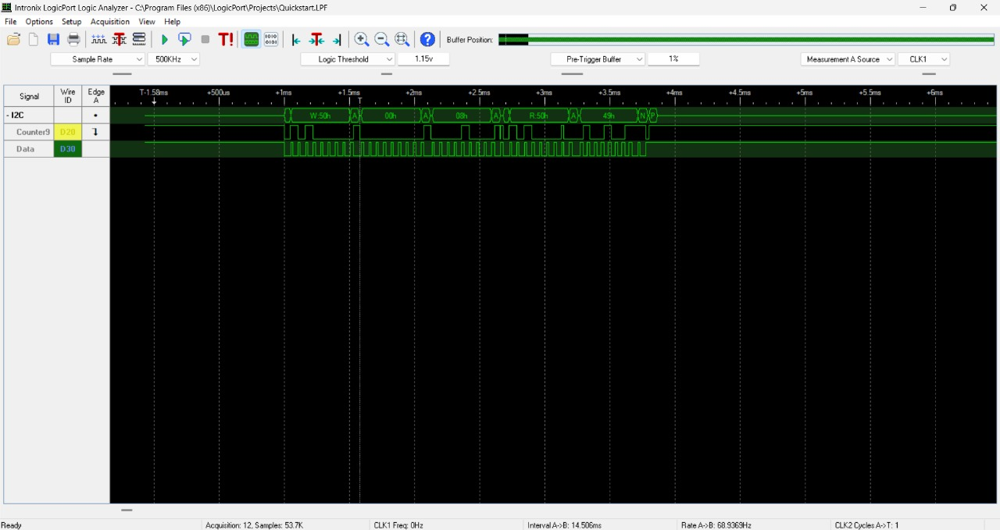

This is a BitBanging I2C files in which I have used the I/O ports of PIC16F886 also I have tested this on Hardware & on Logic Analyzer too.
Here I am attaching the screenshot of Logic Analyzer.

By using I/O ports we are getting transfer speed in milliseconds. 

