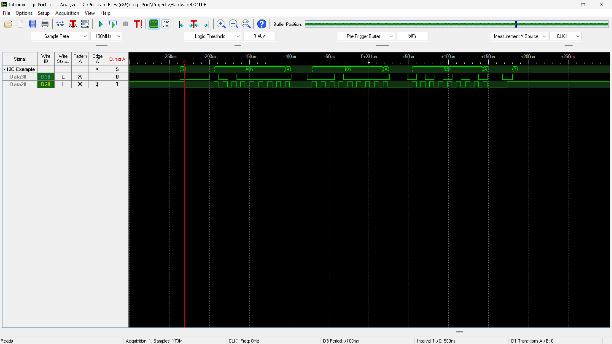

This is a Hardware I2C files in which i have used the SCL and SDA ports of PIC16F886 and tested it on Logic Analyzer. Here I am attaching the screenshot of Logic 
Analyzer.

By using dedicated ports of I2C we get speed in microseconds as you can see this in the screenshot.

